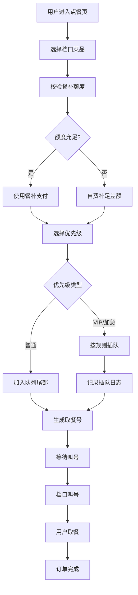

## 1. 产品概述

美食广场订餐取餐APP是一套面向企业员工的智慧用餐管理系统，解决员工就餐排队、VIP优先、餐补额度管控等核心痛点。系统实现排队叫号、优先插队、额度管控、消费明细四大模块，支持按队列叫号取餐、VIP/加急单优先插队留痕、员工餐补月度重置不累加等功能，提升就餐效率和管理透明度。

## 2. 核心功能

### 2.1 用户角色

| 角色 | 注册方式 | 核心权限 |
|------|----------|----------|
| 普通员工 | 企业账户导入 | 点餐取号、查看队列、查看额度、查看消费明细 |
| VIP员工 | 企业账户导入+VIP标记 | 普通员工全部权限 + VIP优先插队 |
| 档口管理员 | 系统分配 | 叫号操作、查看本档口订单、查看分账明细 |
| 系统管理员 | 系统分配 | 全部权限：额度发放、插队管理、数据统计、用户管理 |

### 2.2 功能模块

1. **排队叫号模块**：取号排队、实时队列展示、叫号通知、订单状态跟踪
2. **优先插队模块**：VIP插队处理、加急单插队、插队留痕记录、优先级队列维护、公平性公示
3. **额度管控模块**：餐补额度发放、月度额度自动重置、额度使用扣减、自费模式切换、额度查询
4. **消费明细模块**：个人消费记录、档口分账结算、月度统计报表、插队记录查询

### 2.3 页面详情

| 页面名称 | 模块名称 | 功能描述 |
|----------|----------|----------|
| 首页仪表盘 | 通用模块 | 快捷入口、当前叫号展示、个人额度概览、今日消费统计 |
| 点餐取号页 | 排队叫号 | 选择档口、选择菜品、提交订单、获取取餐号、选择优先级(VIP/加急) |
| 实时队列页 | 排队叫号 | 展示当前叫号、等待队列、预计等待时间、订单状态更新 |
| 叫号管理页 | 排队叫号 | 档口管理员叫号、完成取餐、呼叫下一位、订单状态管理 |
| 插队管理页 | 优先插队 | 插队申请、插队审批、插队记录公示、优先级规则配置 |
| 插队记录页 | 优先插队 | 所有插队历史、插队原因、插队前后位置对比、公平性审核 |
| 我的额度页 | 额度管控 | 当月剩余额度、累计使用、重置日期、消费明细、自费充值 |
| 额度管理页 | 额度管控 | 额度发放、批量重置、额度调整、额度使用统计 |
| 消费明细页 | 消费明细 | 个人消费流水、订单详情、支付方式(餐补/自费)、退款记录 |
| 档口结算页 | 消费明细 | 档口营收统计、分账明细、每日/月度报表、订单对账 |

## 3. 核心流程

### 3.1 点餐取餐流程

用户进入点餐页面 → 选择档口和菜品 → 系统校验餐补额度 → 确认订单并选择优先级(普通/VIP/加急) → 生成取餐号进入队列 → 档口叫号 → 用户取餐 → 扣减额度/自费支付 → 订单完成

### 3.2 额度重置流程

每月1日凌晨 → 系统自动重置所有员工额度 → 上月剩余额度清零不累加 → 发放本月新额度 → 生成重置记录 → 通知员工

### 3.3 插队公平性流程

VIP/加急用户申请插队 → 系统根据优先级规则计算插入位置 → 记录插队前后所有受影响用户 → 公示插队记录(包含原因、时间、位置变化) → 受影响用户可查看 → 管理员可审核申诉

## 4. 用户界面设计

### 4.1 设计风格

- **设计调性**：现代简约、专业商务，融合美食暖色调，营造温馨便捷的用餐氛围
- **主色调**：暖橙色(#FF6B35) - 代表美食、活力、温馨
- **辅助色**：深青色(#1A535C) - 代表专业、信任；金色(#FFD93D) - 代表VIP尊贵
- **中性色**：米白(#F7F7F7)、深灰(#2D3436)、中灰(#636E72)
- **按钮风格**：圆角8px，渐变背景，悬浮微放大效果，点击反馈
- **字体**：标题使用「Noto Sans SC Bold」，正文使用「Noto Sans SC Regular」，数字使用等宽字体增强可读性
- **布局风格**：卡片式布局，顶部导航+侧边栏，模块分区清晰
- **图标风格**：使用lucide-react线性图标，统一24px尺寸，配色与主题一致

### 4.2 页面设计概述

| 页面名称 | 模块名称 | UI元素 |
|----------|----------|--------|
| 首页仪表盘 | 通用模块 | 大型叫号显示屏、个人额度卡片、快捷操作区、今日统计图表、公告轮播 |
| 实时队列页 | 排队叫号 | 当前叫号大号数字展示、等待队列列表、预计时间进度条、叫号声音提示动画 |
| 插队管理页 | 优先插队 | 队列可视化图谱、插队操作面板、插队记录时间轴、受影响用户列表 |
| 我的额度页 | 额度管控 | 额度进度环形图、月度消费曲线、使用明细列表、重置倒计时、自费充值入口 |
| 消费明细页 | 消费明细 | 筛选条件栏、消费流水列表、订单详情弹窗、支付方式标签、统计汇总卡片 |

### 4.3 响应式设计

- **桌面端优先**：1280px以上宽度完整展示所有模块，侧边栏展开
- **平板适配**：768px-1280px，侧边栏可收起为图标模式，卡片自适应换行
- **移动端**：768px以下，底部导航栏取代侧边栏，单列布局，关键信息放大展示
- **触控优化**：按钮最小高度44px，列表项间距增大，支持滑动操作
