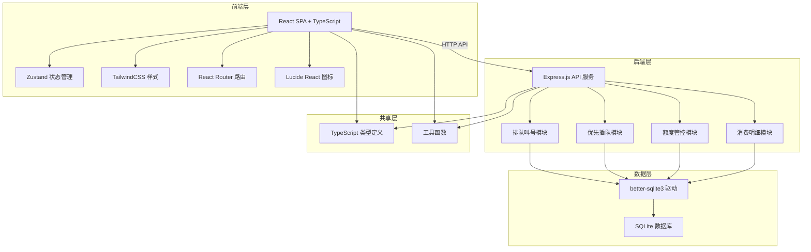
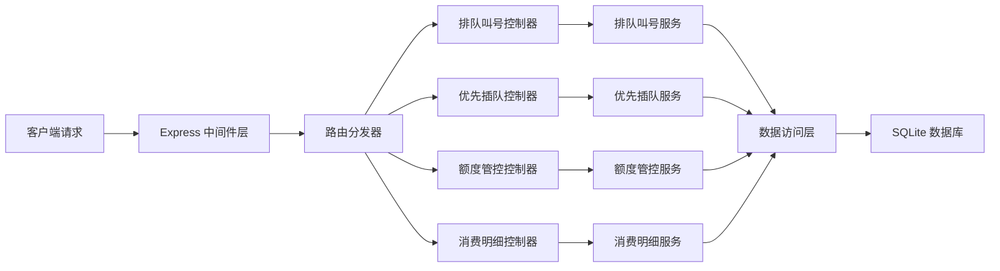
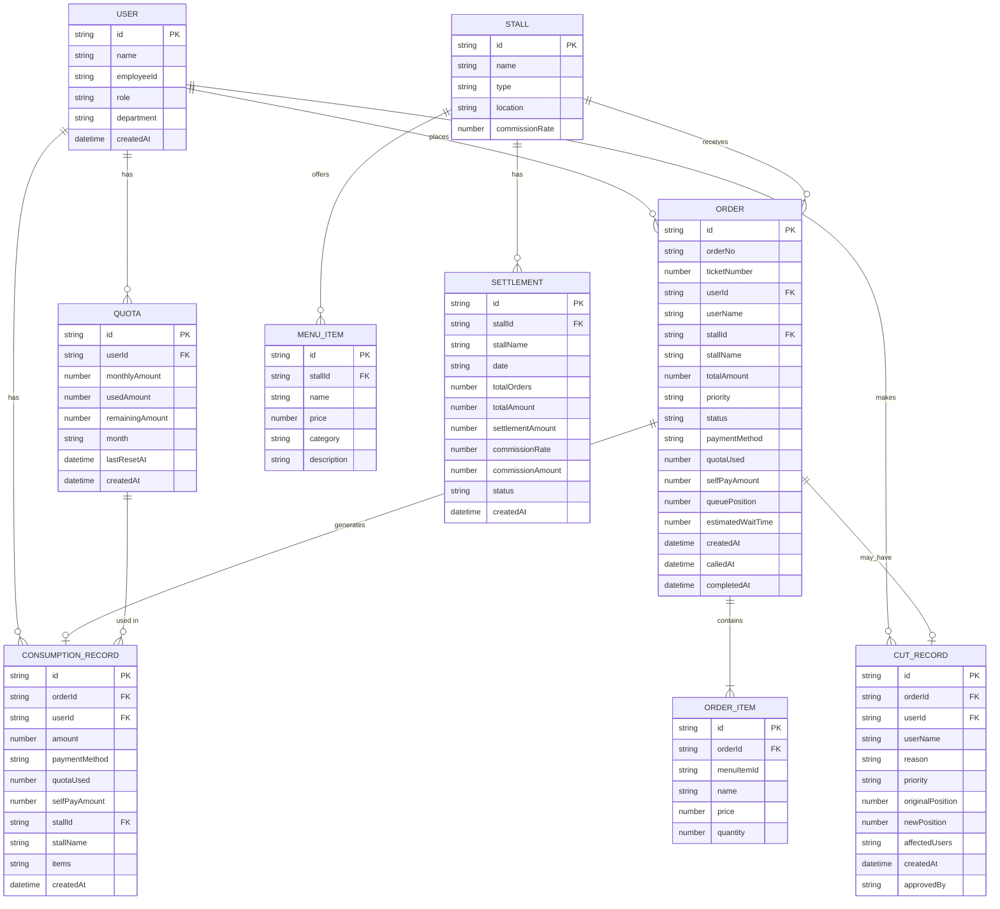

## 1. 架构设计



## 2. 技术描述

- **前端**：React@18 + TypeScript + Vite + TailwindCSS@3 + Zustand + React Router DOM + Lucide React
- **后端**：Express@4 + TypeScript + better-sqlite3
- **初始化工具**：vite-init
- **数据库**：SQLite（内嵌式，无需额外服务），使用mock数据初始化
- **状态管理**：Zustand（轻量级状态管理，替代Redux）
- **样式方案**：TailwindCSS 3 + CSS变量主题系统
- **图标库**：lucide-react

## 3. 路由定义

### 前端路由

| 路由路径 | 页面名称 | 模块归属 |
|----------|----------|----------|
| / | 首页仪表盘 | 通用模块 |
| /order | 点餐取号页 | 排队叫号 |
| /queue | 实时队列页 | 排队叫号 |
| /call | 叫号管理页 | 排队叫号 |
| /cut | 插队管理页 | 优先插队 |
| /cut/records | 插队记录页 | 优先插队 |
| /quota | 我的额度页 | 额度管控 |
| /quota/admin | 额度管理页 | 额度管控 |
| /consumption | 消费明细页 | 消费明细 |
| /settlement | 档口结算页 | 消费明细 |

### 后端API路由

| 方法 | 路由路径 | 模块归属 | 功能描述 |
|------|----------|----------|----------|
| GET | /api/queue | 排队叫号 | 获取当前队列 |
| POST | /api/queue/ticket | 排队叫号 | 取号加入队列 |
| POST | /api/queue/call | 排队叫号 | 叫号（呼叫下一位） |
| POST | /api/queue/complete | 排队叫号 | 完成取餐 |
| POST | /api/cut/apply | 优先插队 | 申请插队 |
| GET | /api/cut/records | 优先插队 | 获取插队记录 |
| GET | /api/quota/:userId | 额度管控 | 获取用户额度 |
| POST | /api/quota/reset | 额度管控 | 重置月度额度 |
| POST | /api/quota/deduct | 额度管控 | 扣减额度 |
| GET | /api/consumption/:userId | 消费明细 | 获取用户消费记录 |
| GET | /api/settlement/:stallId | 消费明细 | 获取档口分账 |

## 4. API 类型定义

```typescript
// 共享类型定义 (shared/types.ts)

export type UserRole = 'employee' | 'vip' | 'stall_admin' | 'admin';
export type OrderPriority = 'normal' | 'vip' | 'urgent';
export type OrderStatus = 'waiting' | 'calling' | 'completed' | 'cancelled';
export type PaymentMethod = 'quota' | 'self_pay' | 'mixed';

export interface User {
  id: string;
  name: string;
  employeeId: string;
  role: UserRole;
  department: string;
  avatar?: string;
}

export interface Quota {
  id: string;
  userId: string;
  monthlyAmount: number;
  usedAmount: number;
  remainingAmount: number;
  resetDate: string;
  month: string;
  lastResetAt: string;
}

export interface MenuItem {
  id: string;
  name: string;
  price: number;
  stallId: string;
  category: string;
  image?: string;
  description?: string;
}

export interface Stall {
  id: string;
  name: string;
  type: string;
  location: string;
}

export interface Order {
  id: string;
  orderNo: string;
  ticketNumber: number;
  userId: string;
  userName: string;
  stallId: string;
  stallName: string;
  items: OrderItem[];
  totalAmount: number;
  priority: OrderPriority;
  status: OrderStatus;
  paymentMethod: PaymentMethod;
  quotaUsed: number;
  selfPayAmount: number;
  queuePosition: number;
  estimatedWaitTime: number;
  createdAt: string;
  calledAt?: string;
  completedAt?: string;
}

export interface OrderItem {
  menuItemId: string;
  name: string;
  price: number;
  quantity: number;
}

export interface QueueItem {
  orderId: string;
  ticketNumber: number;
  userName: string;
  priority: OrderPriority;
  queuePosition: number;
  estimatedWaitTime: number;
  status: OrderStatus;
  stallId: string;
}

export interface CutRecord {
  id: string;
  orderId: string;
  userId: string;
  userName: string;
  reason: string;
  priority: OrderPriority;
  originalPosition: number;
  newPosition: number;
  affectedUsers: string[];
  createdAt: string;
  approvedBy?: string;
}

export interface ConsumptionRecord {
  id: string;
  orderId: string;
  userId: string;
  amount: number;
  paymentMethod: PaymentMethod;
  quotaUsed: number;
  selfPayAmount: number;
  stallId: string;
  stallName: string;
  items: string;
  createdAt: string;
}

export interface Settlement {
  id: string;
  stallId: string;
  stallName: string;
  date: string;
  totalOrders: number;
  totalAmount: number;
  settlementAmount: number;
  commissionRate: number;
  commissionAmount: number;
  status: 'pending' | 'settled';
}
```

## 5. 后端服务架构



## 6. 数据模型

### 6.1 ER图



### 6.2 DDL 语句

```sql
-- 用户表
CREATE TABLE users (
  id TEXT PRIMARY KEY,
  name TEXT NOT NULL,
  employee_id TEXT UNIQUE NOT NULL,
  role TEXT NOT NULL CHECK (role IN ('employee', 'vip', 'stall_admin', 'admin')),
  department TEXT,
  avatar TEXT,
  created_at DATETIME DEFAULT CURRENT_TIMESTAMP
);

-- 额度表
CREATE TABLE quotas (
  id TEXT PRIMARY KEY,
  user_id TEXT NOT NULL REFERENCES users(id),
  monthly_amount REAL NOT NULL DEFAULT 500,
  used_amount REAL NOT NULL DEFAULT 0,
  remaining_amount REAL NOT NULL DEFAULT 500,
  month TEXT NOT NULL,
  last_reset_at DATETIME,
  created_at DATETIME DEFAULT CURRENT_TIMESTAMP,
  UNIQUE(user_id, month)
);

-- 档口表
CREATE TABLE stalls (
  id TEXT PRIMARY KEY,
  name TEXT NOT NULL,
  type TEXT NOT NULL,
  location TEXT,
  commission_rate REAL NOT NULL DEFAULT 0.1
);

-- 菜品表
CREATE TABLE menu_items (
  id TEXT PRIMARY KEY,
  stall_id TEXT NOT NULL REFERENCES stalls(id),
  name TEXT NOT NULL,
  price REAL NOT NULL,
  category TEXT,
  description TEXT,
  image TEXT
);

-- 订单表
CREATE TABLE orders (
  id TEXT PRIMARY KEY,
  order_no TEXT UNIQUE NOT NULL,
  ticket_number INTEGER NOT NULL,
  user_id TEXT NOT NULL REFERENCES users(id),
  user_name TEXT NOT NULL,
  stall_id TEXT NOT NULL REFERENCES stalls(id),
  stall_name TEXT NOT NULL,
  total_amount REAL NOT NULL,
  priority TEXT NOT NULL CHECK (priority IN ('normal', 'vip', 'urgent')),
  status TEXT NOT NULL CHECK (status IN ('waiting', 'calling', 'completed', 'cancelled')) DEFAULT 'waiting',
  payment_method TEXT NOT NULL CHECK (payment_method IN ('quota', 'self_pay', 'mixed')),
  quota_used REAL NOT NULL DEFAULT 0,
  self_pay_amount REAL NOT NULL DEFAULT 0,
  queue_position INTEGER NOT NULL,
  estimated_wait_time INTEGER NOT NULL,
  created_at DATETIME DEFAULT CURRENT_TIMESTAMP,
  called_at DATETIME,
  completed_at DATETIME
);

-- 订单项表
CREATE TABLE order_items (
  id TEXT PRIMARY KEY,
  order_id TEXT NOT NULL REFERENCES orders(id),
  menu_item_id TEXT NOT NULL,
  name TEXT NOT NULL,
  price REAL NOT NULL,
  quantity INTEGER NOT NULL DEFAULT 1
);

-- 插队记录表
CREATE TABLE cut_records (
  id TEXT PRIMARY KEY,
  order_id TEXT NOT NULL REFERENCES orders(id),
  user_id TEXT NOT NULL REFERENCES users(id),
  user_name TEXT NOT NULL,
  reason TEXT NOT NULL,
  priority TEXT NOT NULL,
  original_position INTEGER NOT NULL,
  new_position INTEGER NOT NULL,
  affected_users TEXT NOT NULL,
  created_at DATETIME DEFAULT CURRENT_TIMESTAMP,
  approved_by TEXT
);

-- 消费记录表
CREATE TABLE consumption_records (
  id TEXT PRIMARY KEY,
  order_id TEXT UNIQUE NOT NULL REFERENCES orders(id),
  user_id TEXT NOT NULL REFERENCES users(id),
  amount REAL NOT NULL,
  payment_method TEXT NOT NULL,
  quota_used REAL NOT NULL DEFAULT 0,
  self_pay_amount REAL NOT NULL DEFAULT 0,
  stall_id TEXT NOT NULL REFERENCES stalls(id),
  stall_name TEXT NOT NULL,
  items TEXT NOT NULL,
  created_at DATETIME DEFAULT CURRENT_TIMESTAMP
);

-- 结算表
CREATE TABLE settlements (
  id TEXT PRIMARY KEY,
  stall_id TEXT NOT NULL REFERENCES stalls(id),
  stall_name TEXT NOT NULL,
  date TEXT NOT NULL,
  total_orders INTEGER NOT NULL DEFAULT 0,
  total_amount REAL NOT NULL DEFAULT 0,
  settlement_amount REAL NOT NULL DEFAULT 0,
  commission_rate REAL NOT NULL DEFAULT 0.1,
  commission_amount REAL NOT NULL DEFAULT 0,
  status TEXT NOT NULL CHECK (status IN ('pending', 'settled')) DEFAULT 'pending',
  created_at DATETIME DEFAULT CURRENT_TIMESTAMP,
  UNIQUE(stall_id, date)
);

-- 创建索引
CREATE INDEX idx_orders_stall_status ON orders(stall_id, status);
CREATE INDEX idx_orders_user ON orders(user_id);
CREATE INDEX idx_consumption_user ON consumption_records(user_id);
CREATE INDEX idx_consumption_stall ON consumption_records(stall_id, created_at);
CREATE INDEX idx_cut_records_order ON cut_records(order_id);
```
